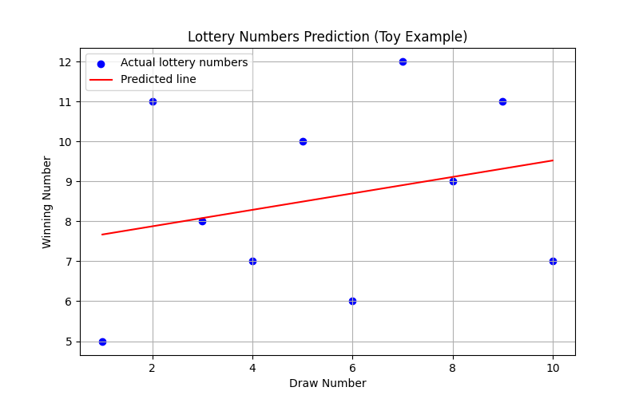
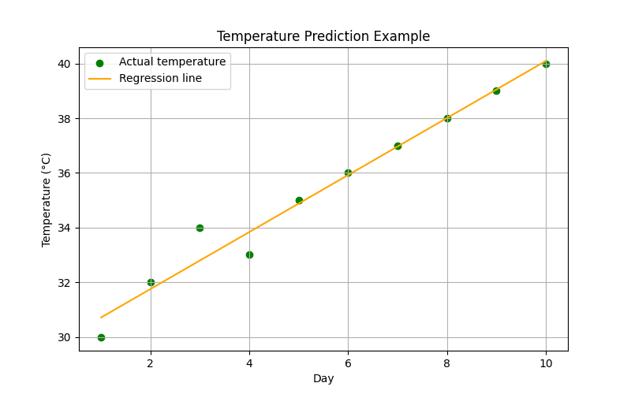
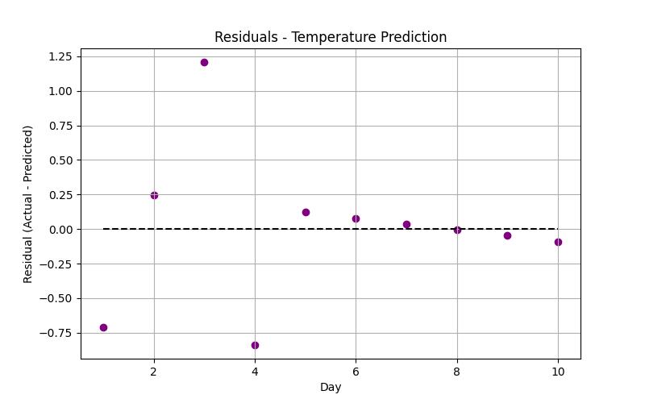

# Linear Regression Notes

Linear Regression is a foundational algorithm in AI/ML used to model the relationship between a dependent variable (y) and one or more independent variables (X).  
The goal is to fit a **line (or hyperplane for multiple variables)** that best approximates the data.

---

## 1. Basic Understanding

- **Goal:** Predict y from X using a straight line.  
- **Line equation:** $y = mX + c$  
  - $m$ = slope &rarr; how much y changes with X  
  - $c$ = intercept &rarr; the baseline value of y when X=0  
- **Intuition:**  
  - The line tries to pass **as close as possible** to all points.  
  - The “closeness” is measured using errors (residuals):  
    $residual = y - \hat{y}$  

**Key Concept:** Linear Regression finds the line that **minimizes total error**.  

---

## 2. Formulas

### 2.1 Predicted Value
$\hat{y} = mX + c$

### 2.2 Error / Residual
$error_i = y_i - \hat{y}_i$

### 2.3 Loss Function (Mean Squared Error)
$MSE = \frac{1}{n} \sum_{i=1}^{n} (y_i - \hat{y}_i)^2$

### 2.4 Slope (m) and Intercept (c) for Single Variable
$m = \frac{\sum (X_i - \bar{X})(y_i - \bar{y})}{\sum (X_i - \bar{X})^2}$

$c = \bar{y} - m \cdot \bar{X}$

- $X_i$, $y_i$ &rarr; individual data points  
- $\bar{X}$, $\bar{y}$ &rarr; means of X and y  
- $m$ &rarr; how much y changes per unit change in X  
- $c$ &rarr; starting value of y when X=0  

---

## 3. How It Works

1. **Analyze Data:** Each point has an input (X) and output (y).  
2. **Measure Error:** Difference between predicted y and actual y.  
3. **Find Best Line:** Adjust m and c to minimize total error (sum of squared errors).  
4. **Prediction:** Use the final line to estimate y for any X.  

**Visual Intuition:**  
- Scatter plot &rarr; line passes through the “middle” of points  
- Residuals &rarr; vertical distance from point to line  
- Smaller residuals = better fit  

---

## 4. Advanced Concepts

### 4.1 Gradient Descent (Manual Optimization)

- Imagine **walking downhill** on a hill where height = total error.  
- Each step adjusts slope (m) and intercept (c) to reduce error.

**Update Rules:**  
$m = m - lr \cdot \frac{\partial MSE}{\partial m}$  
$c = c - lr \cdot \frac{\partial MSE}{\partial c}$

Gradients:  
$\frac{\partial MSE}{\partial m} = -\frac{2}{n} \sum X_i (y_i - (mX_i + c))$  
$\frac{\partial MSE}{\partial c} = -\frac{2}{n} \sum (y_i - (mX_i + c))$

- $lr$ &rarr; learning rate, small number controlling step size  
- Repeat until MSE converges &rarr; best slope and intercept  

---

### 4.2 Multiple Linear Regression

- For multiple features:  
$y = m_1 X_1 + m_2 X_2 + ... + m_n X_n + c$

- Concept: Find a **hyperplane** that minimizes total squared error.  
- Can be solved manually with **matrix operations**:
$\hat{\beta} = (X^T X)^{-1} X^T y$  
- Prediction:  
$\hat{y} = X \hat{\beta}$  

**Intuition:** Each feature has a slope &rarr; influence on y; intercept adjusts baseline.

---

# Linear Regression - Summary Report

This file summarizes the Linear Regression learning path so far, including basic calculations and actual examples.  
All generated plots are stored in the `images/` folder.

---

## 1. Basic Calculations

Linear Regression fits a straight line to predict output \($y$\) from input \($X$\).  

**Key formulas:**

- Predicted value:  
  $y_hat = m * X + c$  

- Residuals (error):  
  $residual = y - y_hat$  

- Mean Squared Error (MSE):  
  $MSE = mean(residual^2)$  

- Slope (m):  
  $m = sum((X - mean(X)) * (y - mean(y))) / sum((X - mean(X))^2)$  

- Intercept (c):  
  $c = mean(y) - m * mean(X)$  

**Explanation:**
- Slope = how much y changes per unit X  
- Intercept = baseline value when X = 0  
- MSE = how well the line fits the data  

All of these calculations were implemented manually in `1_basic_calculations/linear_regression_basics.py`.

**Sample Dataset:**  
$X_i$: `[1, 2, 3, 4, 5]`  
$y_i$: `[2, 4, 5, 4, 5]`

**Results**:
- Slope: `m = 0.60`
- Inctercept: `c = 2.20`
- Predicted $\hat{y}_i$ for respective $X_i$: `[2.8000000000000003, 3.4000000000000004, 4.0, 4.6, 5.2]`
- Residuals: `[-0.8000000000000003, 0.5999999999999996, 1.0, -0.5999999999999996, -0.20000000000000018]`
- Mean Squared Error: `MSE = 0.48`

---

## 2. Actual Examples

We applied Linear Regression to **two examples** using Python and scientific libraries:

### 2.1 Lottery Prediction (Toy Example)

- Dataset: Previous lottery draw numbers (toy example)  
- Purpose: Demonstrate linear trend even on random-like small data  

**Results:**  

- Slope: `m = 0.21`   
- Intercept: `c = 7.47`  
- MSE: `4.69`  

**Visualizations:**  
  
*(Scatter plot + regression line)*

---

### 2.2 Temperature Prediction

- Dataset: Average daily temperatures over 10 days  
- Purpose: Show linear trend in real-world-like data  

**Results:**  

- Slope: `m = 1.04`  
- Intercept: `c = 29.67`  
- MSE: `0.28`  

**Visualizations:**  
  
*(Scatter plot + regression line)*

**Residuals Plot:**  
  
*(Shows difference between actual and predicted values)*

---

# Key Takeaways

- Linear Regression = fitting a line that predicts outputs from inputs  
- Slope = influence of input; intercept = baseline  
- Residuals show fit quality; smaller residuals = better line  
- Gradient Descent = iterative method to find optimal line  
- Multiple Linear Regression handles several features at once  
- Understanding formulas = able to implement it **from scratch**  

---

# Conceptual Exercises

1. Visualize small datasets and draw best-fit lines.  
2. Compute slope and intercept manually using formulas.  
3. Calculate residuals and MSE.  
4. Think of gradient descent as “walking downhill” to minimize error.  
5. Extend logic to two or more variables manually.  
