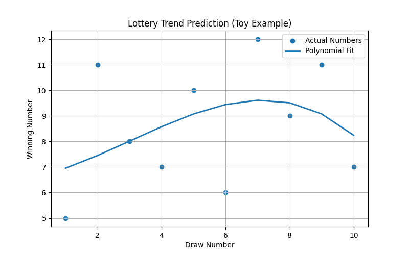
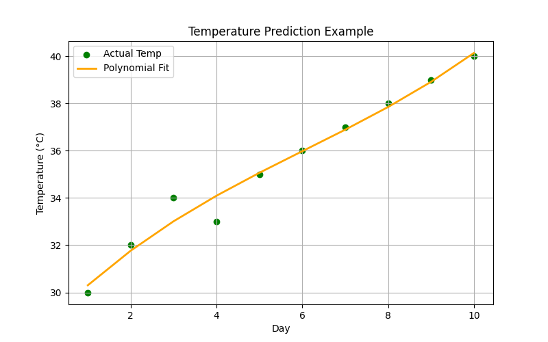
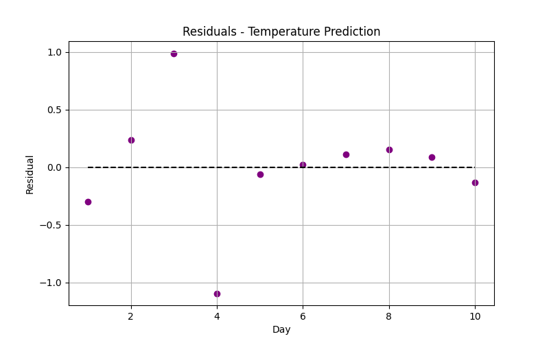

# Polynomial Regression Notes

Polynomial Regression extends Linear Regression by fitting a **curved polynomial** instead of a straight line.

The model tries to fit:

$$
\hat{y} = a_0 + a_1x + a_2x^2 + \dots + a_dx^d
$$

Where:  
- \( d \) = degree of polynomial  
- \( a_0, a_1, \dots, a_d \) = coefficients we want to calculate  

---

## 1. Why Polynomial Regression?

Linear Regression fits only straight lines.  
Polynomial Regression can fit:

- Curves  
- U-shaped patterns  
- Non-linear trends  

It still remains a **linear model in parameters** (because parameters are linear),  
so the math works almost identically to linear regression.

---

## 2. Normal Equation Form

For polynomial regression, we construct:

- A matrix **A**  
- A coefficient vector **X**  
- A target vector **B**

And solve:

$$
AX = B
$$

Then:

$$
X = A^{-1}B
$$

---

## 3. Building Matrix A (Using Summations)

For degree \( d \), matrix \( A \) is:

$$
A =
\begin{bmatrix}
n & \sum x & \sum x^2 & \cdots & \sum x^d \\
\sum x & \sum x^2 & \sum x^3 & \cdots & \sum x^{d+1} \\
\sum x^2 & \sum x^3 & \sum x^4 & \cdots & \sum x^{d+2} \\
\vdots & \vdots & \vdots & \ddots & \vdots \\
\sum x^d & \sum x^{d+1} & \sum x^{d+2} & \cdots & \sum x^{2d}
\end{bmatrix}
$$

This matches exactly the formula you described earlier:

- First row → \( [n, \bar{x}, \bar{x}^2, ..., \bar{x}^d] \)  
- Actually using **summations**, not means  

---

## 4. Building Vector B

$$
B =
\begin{bmatrix}
\sum y \\
\sum xy \\
\sum x^2 y \\
\vdots \\
\sum x^d y
\end{bmatrix}
$$

---

## 5. Solving for Coefficients  
We compute:

$$
X = A^{-1}B
$$

Where:

$$
X =
\begin{bmatrix}
a_0 \\ a_1 \\ a_2 \\ \vdots \\ a_d
\end{bmatrix}
$$

---

## 6. Prediction Formula

Once coefficients are found:

$$
\hat{y}_i = a_0 + a_1x_i + a_2x_i^2 + \dots + a_dx_i^d
$$

---

## 7. Error Calculation

### Residual
$$
error_i = y_i - \hat{y}_i
$$

### Mean Squared Error
$$
MSE = \frac{1}{n}\sum_{i=1}^{n}(y_i - \hat{y}_i)^2
$$

---

## 8. Intuition Behind Polynomial Regression

- We map input \( x \) to:  
  \( [x, x^2, x^3, ..., x^d] \)
- Then we perform **linear regression over expanded features**
- Higher degrees = more flexible curve
- Too high degree = **overfitting**

---

# Polynomial Regression - Summary Report

This file summarizes the Polynomial Regression learning path so far, including basic calculations and actual examples.  
All generated plots are stored in the `images/` folder.

---

## 1. Basic Calculations

Polynomial Regression fits a polynomial to predict output \($y$\) from input \($X$\).  

**Key formulas:**

- Polynomial model:  
  $\hat{y} = a_0 + a_1 x + a_2 x^2 + \dots + a_d x^d$  

- Coefficient matrix (A):  
  $A_{i,j} = \sum x^{i+j}$  

- Dependent vector (B):  
  $B_i = \sum x^i y$  

- Solve for coefficients:  
  $X = A^{-1} B$  

**Explanation:**
- Matrix A = built from sums of powers of x  
- Vector B = built from sums of x powers times y  
- X = coefficient vector \($[a_0, a_1, ..., a_d]$\)  
- Residuals = difference between actual y and predicted $\hat{y}$  
- MSE = measure of fit quality  

All of these calculations were implemented manually in `01_regression/02_polynomial_regression/polynomial_regression_basics.py`.

**Sample Dataset:**  
$X_i$: `[1, 2, 3, 4, 5]`  
$y_i$: `[2, 4, 5, 4, 5]`  
Degree: `3`

**Results:**
- Coefficients: `a0,a1,a2,a3 = [-4.000000000000114, 8.214285714285552, -2.5357142857143913, 0.24999999999998934]`  
- Predicted $\hat{y}_i$: `[1.9285714285710363, 4.28571428571334, 4.571428571426733, 4.285714285711151, 4.928571428566531]`  
- Residuals: `[0.07142857142896375, -0.2857142857133397, 0.42857142857326735, -0.2857142857111512, 0.07142857143346859]`  
- Mean Squared Error: `MSE = 0.0714`

---

## 2. Actual Examples

We applied Polynomial Regression to **two real-world examples** using Python and scientific libraries (NumPy, Matplotlib).

### 2.1 Lottery Prediction (Toy Example)

- Dataset: Previous lottery draw numbers (toy data)  
- Purpose: Show polynomial trend on small irregular dataset  
- Degree: `3`  

**Results:**  
- Coefficients: `[6.599999999999852, 0.26534576534595544, 0.1025641025641022, -0.011266511266511792]`  
- Mean Squared Error: `4.28`  

**Visualizations:**  
**Polynomial Fit Curve:**  
  

---

### 2.2 Temperature Prediction

- Dataset: Average daily temperatures over 10 days  
- Purpose: Show polynomial trend in real-world-like data  
- Degree: `3`  

**Results:**  
- Coefficients: `[28.566666666666606, 1.889083139083823, -0.16258741258735654, 0.008935508935513425]`  
- Mean Squared Error: `0.24`  

**Visualizations:**  
**Polynomial Fit Curve:**  
  
**Residuals:**  

---

# Key Takeaways

- Basics file = core math, summation formulas, AX = B, matrix inverse  
- Examples file = real data, visual graphs, scientific libraries  
- Polynomial regression captures **curved relationships**  
- Higher degree &rarr; more flexibility but higher overfitting risk  
- Understanding formulas enables implementing regression **from scratch**

---

# Conceptual Exercises

1. Try fitting polynomials of different degrees (1–6) and compare MSE.  
2. Plot actual vs predicted values for each degree.  
3. Compute residuals manually and visualize.  
4. Implement AX = B using summation-based matrix construction.  
5. Experiment with real datasets: temperature, stock prices, or lottery draws.
